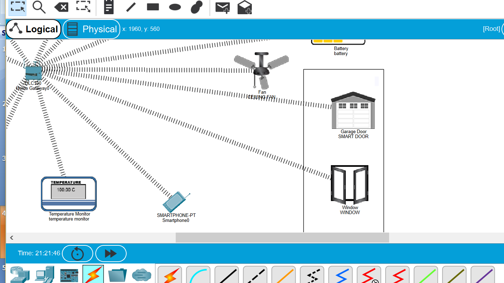

# Garage-Control-Simulation-Using CISCO_PACKET_TRACER
**Cisco Packet Tracer is a cross-platform visual simulation tool designed by Cisco Systems that allows users to create network topologies and imitate modern computer networks. This Software can also be used for visualisation of smart devices activities by using IOT.**

**This project mainly focuses on the automation of garage systems by using the Home Gateway of packet tracer and also by making use of smart devices available**
## In this Project ,the smart devices used are  
   * HOME GATEWAY
   * CO2 DETECTOR.
   * SMART WINDOW,DOOR.
   * HUMIDITY MONITOR
   * BATTERY
   * TEMPERATURE MONITOR
   * MOTION DETECTOR
   * WEB CAM
   * SMART LIGHT
   * FIRE DETECTOR
   * SPRINKLER
   * MICRO CONTROLLER 
   * SMART PHONE 
   * FIRE ALARM
## CONNECTIONS

    - Home Gateway is connected to every smart device 
    - Different IP address is given to smart devices 
    - Programming of different smart devices is done according to the requirement of application
    - Change the configuration of every smart device to home gateway(IOT SERVER)
    - Click the I/O Config tab and change the Network Adapter type to the PT-IOT-NM-1W wireless adapter.
    - For the fire sprinkler and fire detector part ,we connect the fire detector to the home gateway 
    - We Use custom cables for connecting MCU and fire sprinkler
    
## Working (Screenshots attached at the end).

* Conditions are given in the home gateway which is connected to smart phone and it can be made manual or automatic based on the situation.

* We had put a threshold value for the CO2 emmission based on which the automation of smart windows and smart doors is done.

* We Used Fire detecting sensor to detect any fire in the garage 
       * if it detects any little smoke ,it will turn on the alarm.
       * if it detects the fire ,then it will turn on the sprinkler and alarm.

* we used temperature sensor and also humidity sensor to switch on /off fans in the owner office.

* We Used Motion detecting sensor ,to check for any thefts that happen in the garage 
    * when it detects the motion it will switch on smart lights and will switch on the CCTV camera.
    
## MICRO CONTROLLER UNIT CODE

```
from gpio import *
from time import *

def handleSensorData():
	value = digitalRead(0)
	if value == 0:
		customWrite(1, '0')
	else:
		customWrite(1, '1')
    
def main():
	add_event_detect(0, handleSensorData) 
	
	while True:
		delay(1000)

if __name__ == "__main__":
	main()
```
    
## Screenshots

### 1.TOTAL PROJECT.


### 2. CO2 DETECTOR.


### 3. SMART DOOR OPENING AFTER DETECTING LITTLE SMOKE.




### 4. BEFORE FIRE DETECTING.

.png)


### 5. AFTER FIRE DETECTING.

.png)


### 6. BEFORE DETECTING MOTION ACTIVITY.

.png)


### 7.AFTER DETECTING MOTION ACTVITY.

.png)


## Further Scope 
* We can still make few more automations such as ,switching on the smart lights after some time prescribed by the user .
* We can make the arrangement for the parking of the vehicles by using ```Intelligent smart parking algorithm```
     1. You can read more about it [HERE](https://ieeexplore.ieee.org/document/8358524)
* We can take into the consideration of the battery and power consumptions of the entire garage and minimise the power utilisation,by    turning off electrical devices when we are not using them.


### If you need the Power point Presentation work regarding this project,You can find the ppt in the master branch .

### Video explanation of the same is [Here](https://www.youtube.com/watch?v=St6utP4SqkI)

<pre>                                                Copyrights [2020] [BILLE GIRITEJA] </pre>                                        


### If you find this useful, let me know that , it would make my day 
    
    
